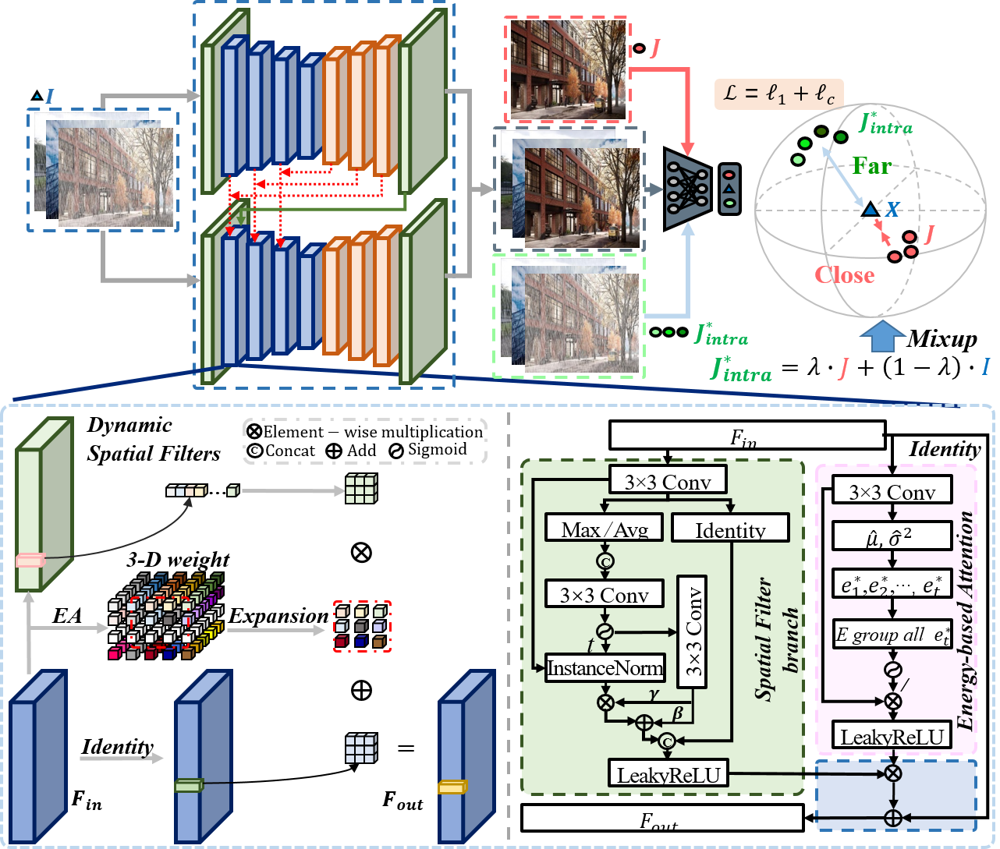

DRCNet: Dynamic Image Restoration Contrastive Network
---
#### Fei Li, Lingfeng Shen, Yang Mi, Zhenbo Li
####
> Image restoration aims to recover images from spatially-varying degradation. Most existing image-restoration models employed static CNN-based models, where the fixed learned filters cannot fit the diverse degradation well. To address this, in this paper, we propose a novel Dynamic Image Restoration Contrastive Network (DRCNet). The principal block in DRCNet is the Dynamic Filter Restoration module (DFR), which mainly consists of the spatial filter branch and the energy-based attention branch. Specifically, the spatial filter branch suppresses spatial noise for varying spatial degradation; the energy-based attention branch guides the feature integration for better spatial detail recovery. To make degraded images and clean images more distinctive in the representation space, we develop a novel Intra-class Contrastive Regularization (Intra-CR) to serve as a constraint in the solution space for DRCNet. Meanwhile, our theoretical derivation proved Intra-CR owns less sensitivity towards hyper-parameter selection than previous contrastive regularization. DRCNet achieves state-of-the-art results on the ten widely-used benchmarks in image restoration. Besides, we conduct ablation studies to show the effectiveness of the DFR module and Intra-CR, respectively.


### Network Architecture



### Installation

This implementation based on [BasicSR](https://github.com/xinntao/BasicSR) which is a open source toolbox for image/video restoration tasks. 

```python
python 3.8.10
pytorch 1.7.1
cuda 11.0
```


### License

This project is under the MIT license, and it is based on [BasicSR](https://github.com/xinntao/BasicSR) which is under the Apache 2.0 license.


### Citations

If DRCNet helps your research or work, please consider citing DRCNet.
```
@InProceedings{lidrcnet_2022_ECCV,
    author    = {Li, Fei and Shen, Lingfeng and Mi, Yang and Li, Zhenbo},
    title     = {DRCNet: Dynamic Image Restoration Contrastive Network},
    booktitle = {European conference on computer vision},
    year      = {2022},
    organization={Springer}
}
```

### Contact
If you have any questions, please contact leefly072@cau.edu.cn or lshen30@jh.edu.


## Acknowledgement
A large part of the code is borrowed from [HINet](https://github.com/megvii-model/HINet), [MPRNet](https://github.com/swz30/MPRNet), [RN](https://github.com/geekyutao/RN) and [SimAM](https://github.com/ZjjConan/SimAM). 
Thanks for their wonderful works!
